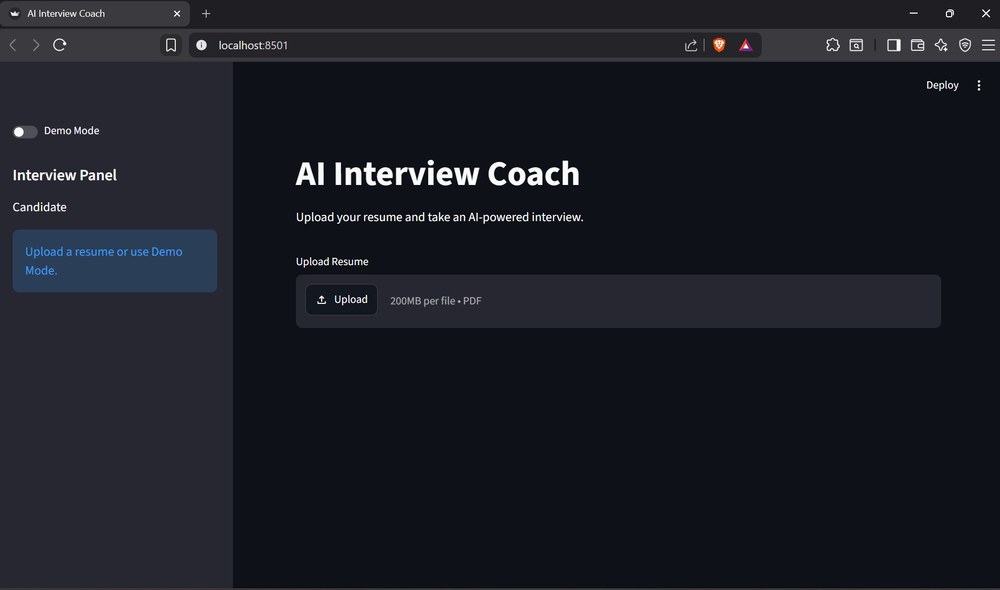
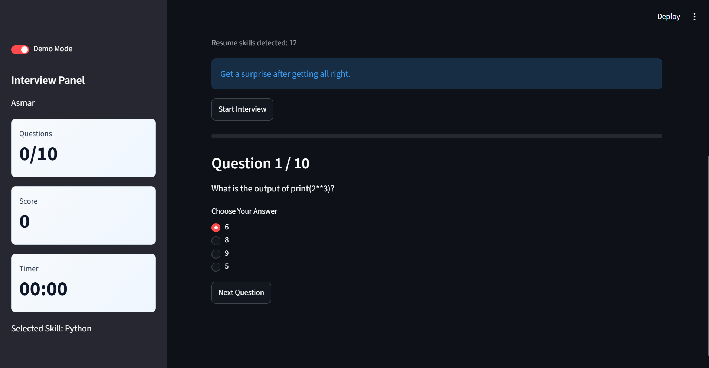
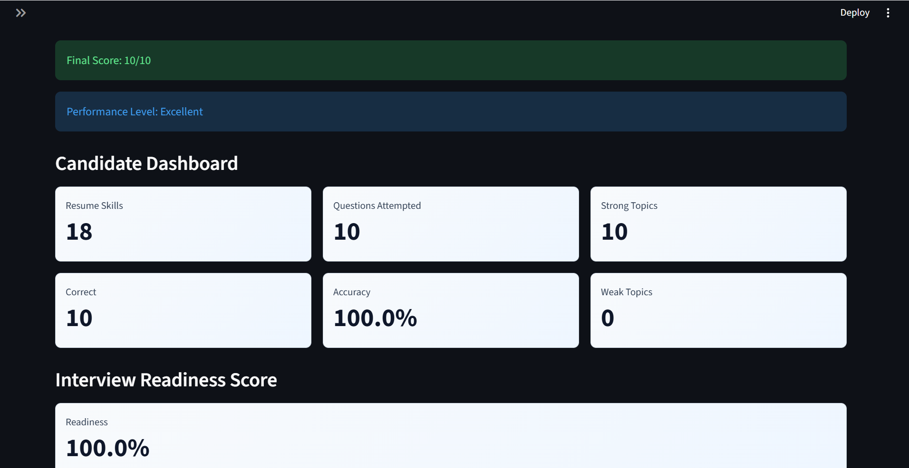
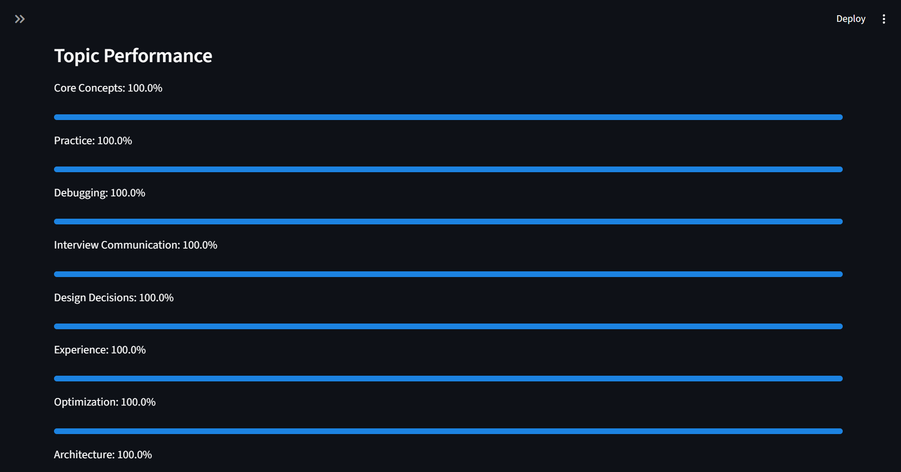
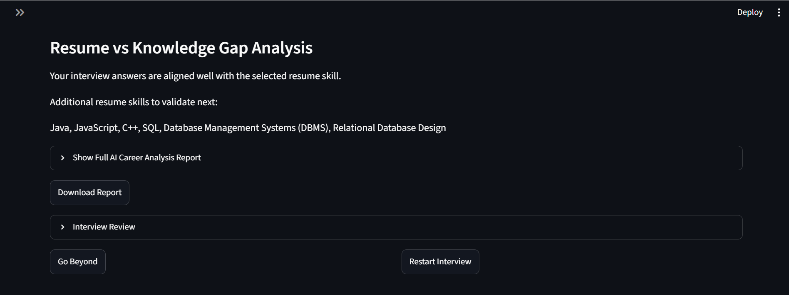
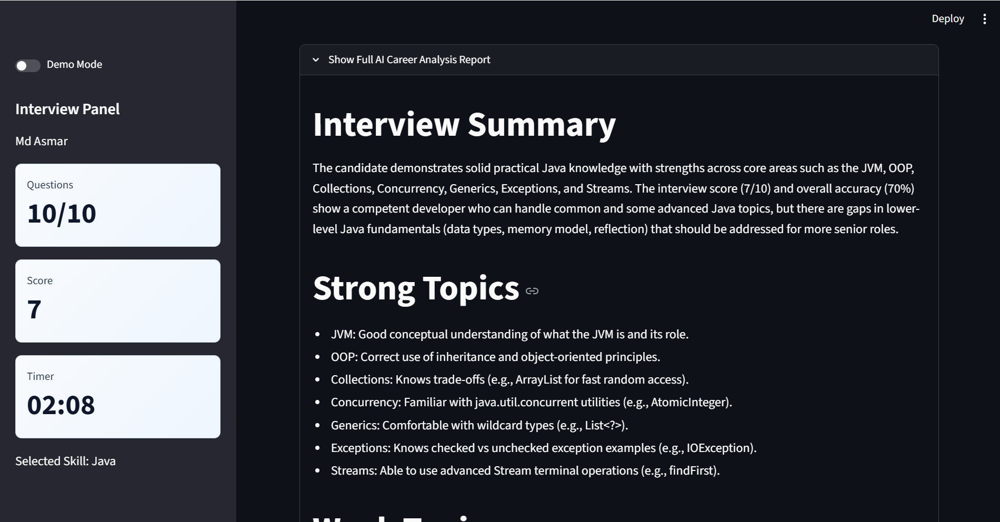
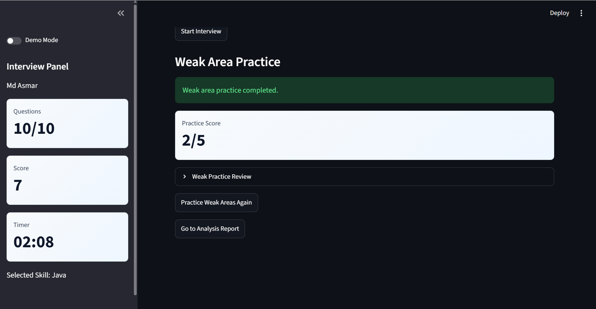
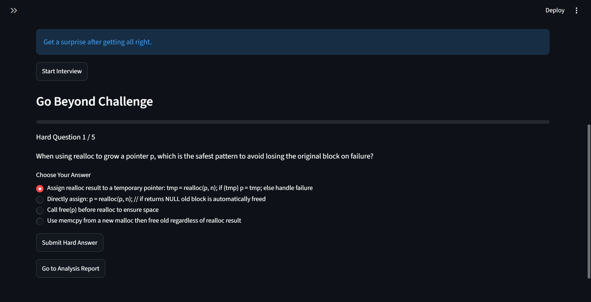

# Demo Steps

Use this flow for a fast hackathon presentation.

## Quick Start

```bash
pip install -r requirements.txt
streamlit run app.py
```

## Judge Walkthrough

1. Open the Streamlit app.

2. Enable Demo Mode in the sidebar.

3. Select a technical skill, such as Python or Streamlit.

4. Click Start Interview.


5. Answer the 10 MCQs.
6. Show the score, dashboard, topic performance, difficulty analysis, and readiness score.




7. Open the AI Career Analysis Report expander.


8. Click Download Report to show the generated Markdown export.

9. If the score is below 10/10, click Practice Weak Areas.

10. If the score is 10/10, show the Congratulations popup and click Go Beyond.



## What To Highlight

- The interview is based on resume skills instead of generic questions.
- The app gives immediate analytics after the interview.
- Weak-area practice appears only when the candidate needs improvement.
- The Go Beyond challenge rewards a perfect score with 5 harder questions.
- Offline fallbacks keep the demo usable even if the AI service is unavailable.
