# AI Interview Coach

AI Interview Coach is a Streamlit-based resume interview simulator that helps candidates practice technical interviews from their own resume. The app extracts skills from a PDF resume, generates a focused MCQ interview for a selected skill, scores the candidate, identifies weak topics, and produces a downloadable career analysis report.

## Problem Solved

Job seekers often do not know whether they can confidently explain the skills listed on their resume. Generic interview prep also wastes time because it is not tailored to the candidate's actual profile. AI Interview Coach solves this by turning resume skills into an interactive interview, giving instant performance analytics, and recommending targeted practice.

## Key Features

- Resume PDF upload with automatic text extraction.
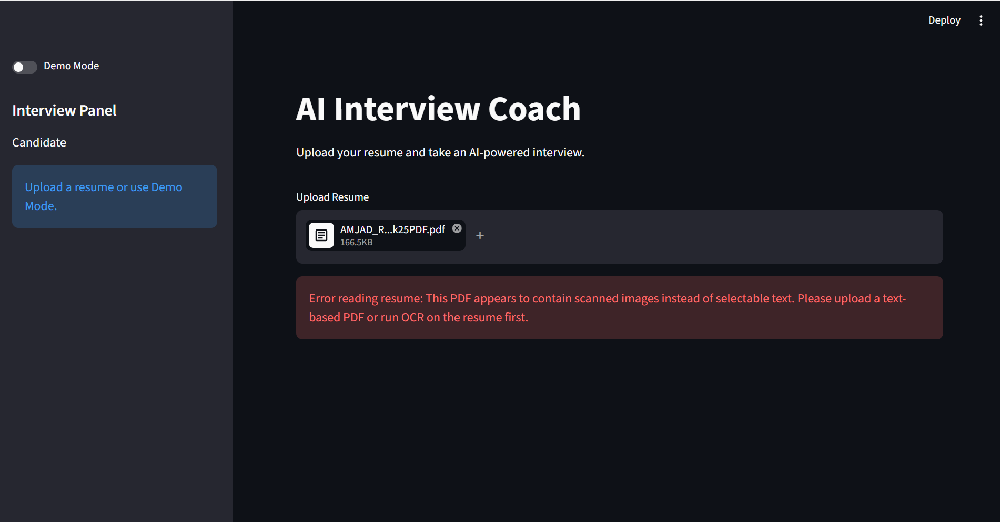
- AI-assisted skill extraction from resume content.
- Demo Mode for quick hackathon judging without needing a resume.
- 10-question skill-specific interview with easy, medium, and hard MCQs.
- Candidate dashboard with score, accuracy, difficulty breakdown, topic performance, and readiness score.
- Resume vs knowledge gap analysis to show which resume skills still need validation.
- Weak-area practice flow for candidates who miss questions.
- Perfect-score surprise popup for 10/10 candidates.
- Go Beyond challenge with 5 hard questions for candidates who get all main interview questions right.
- Downloadable Markdown interview report.
- Offline fallback questions and fallback reports so the demo remains usable if the AI service is unavailable.

## How It Works

1. Upload a PDF resume or enable Demo Mode.
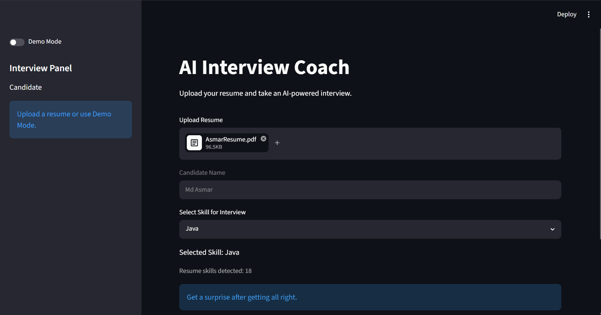
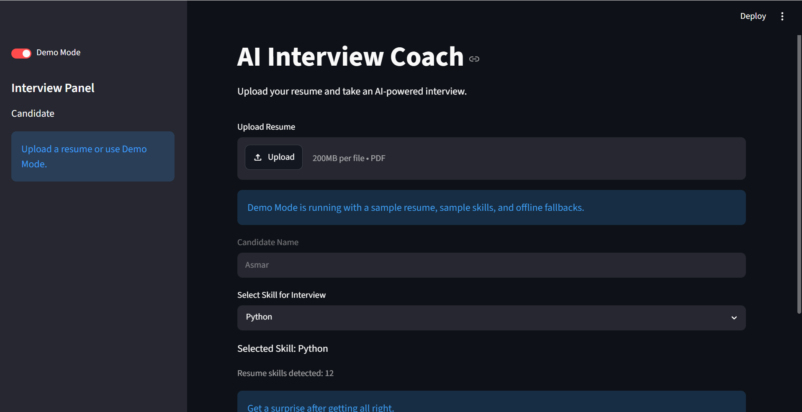
2. The app extracts resume text and identifies technical skills.
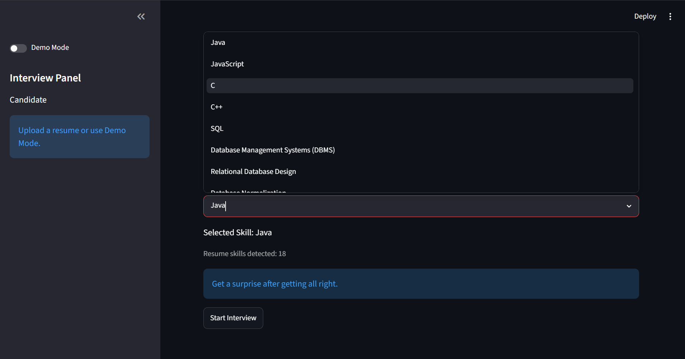
3. Select one skill for the interview.
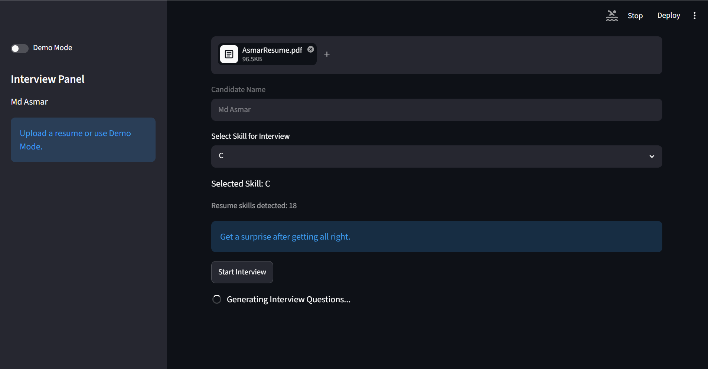
4. Answer 10 AI-generated MCQs.
5. Review the dashboard, report, and interview answers.
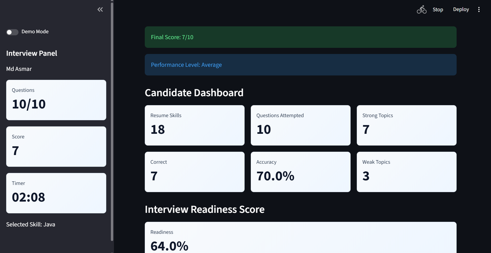
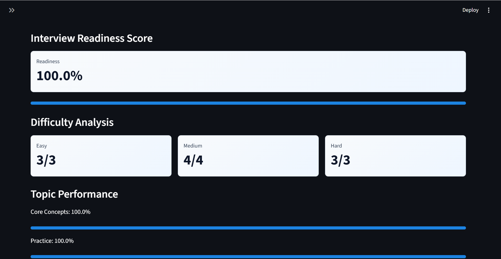
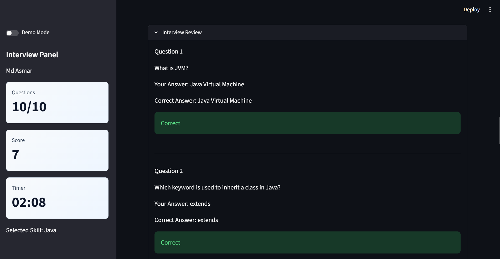
6. If the score is below 10/10, use Practice Weak Areas.
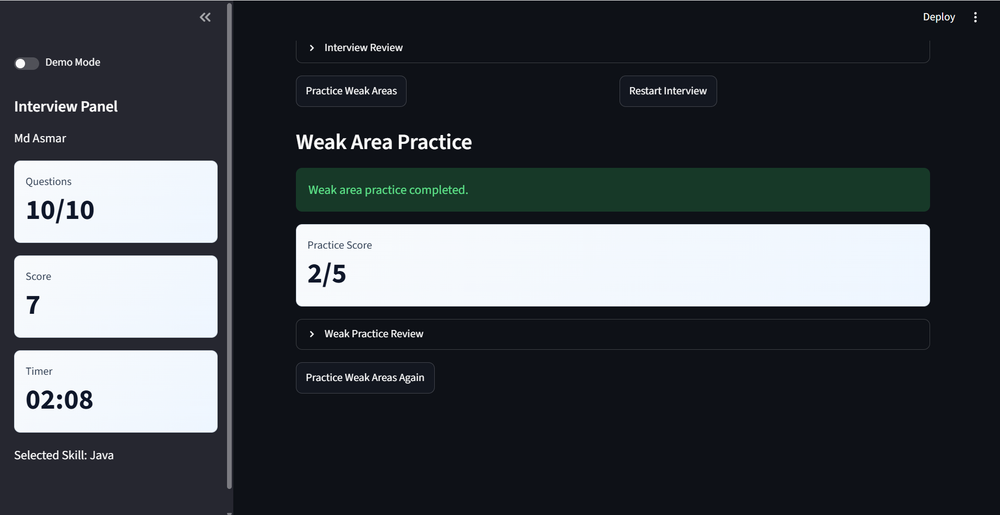
7. If the score is 10/10, unlock the Go Beyond hard-question challenge.
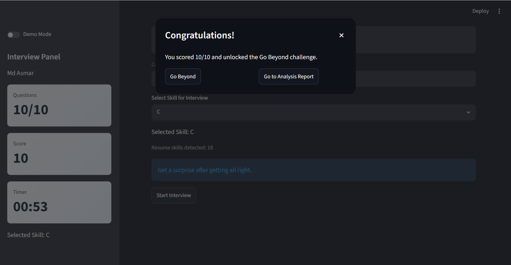
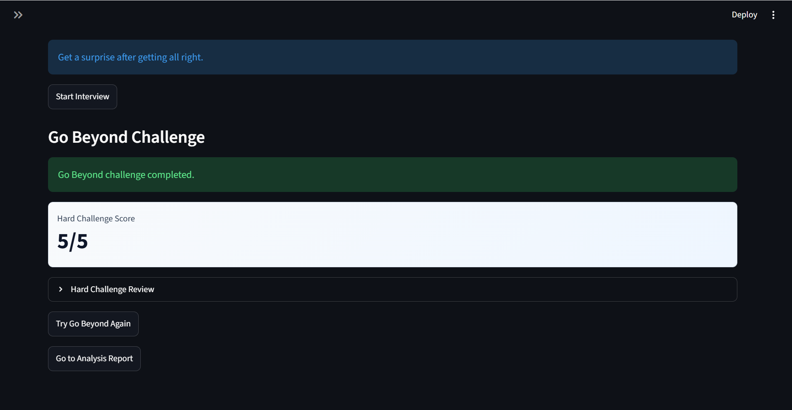

## Technology Used

- Python
- Streamlit
- Azure AI Foundry project client
- Azure OpenAI-compatible Responses API
- Azure Identity
- pypdf for resume PDF parsing
- python-dotenv for local environment configuration

## Architecture Diagram
-

## Project Structure

- `app.py` - Streamlit entry point.
- `ui.py` - Main app flow, resume setup, skill selection, and interview question UI.
- `ui_results.py` - Result dashboard, report view, perfect-score popup, and action routing.
- `mcq_generator.py` - AI MCQ generation, hard challenge generation, validation, and fallbacks.
- `weak_practice.py` - Weak-area practice quiz flow.
- `go_beyond.py` - Perfect-score hard challenge quiz flow.
- `analytics.py` - Score, accuracy, topic, difficulty, and weak/strong topic analytics.
- `report_generator.py` - AI career analysis report generation and fallback report.
- `report_export.py` - Downloadable Markdown report formatting.
- `resume_parser.py` - PDF text extraction.
- `skill_extractor.py` - Resume skill extraction.
- `app_utils.py` - Shared formatting, parsing, and scoring helpers.
- `constants.py` - Demo resume, demo skills, and app styling.
- `session_state.py` - Streamlit session defaults and cleanup helpers.
- `tests/` - Lightweight unit tests for core logic.
- `DEMO_STEPS.md` - Hackathon presentation walkthrough.
- `.env.example` - Environment variable template.
- `requirements.txt` - Python dependencies.

## Run Locally

Create and activate a virtual environment, install dependencies, then run Streamlit:

```bash
pip install -r requirements.txt
streamlit run app.py
```

## Run Tests

```bash
python -m unittest discover -s tests
```

## Environment Variables

Copy `.env.example` to `.env` when using Azure AI:

```env
AZURE_AI_PROJECT_ENDPOINT=your_project_endpoint
AZURE_OPENAI_DEPLOYMENT=your_model_deployment_name
```

The app uses `DefaultAzureCredential`, so sign in with an Azure identity that has access to the configured AI Foundry project.

## Hackathon Demo Flow

For the fastest judging experience:

1. Open the app.
2. Turn on Demo Mode.
3. Select a skill such as Python or Streamlit.
4. Start the interview.
5. Complete the 10 MCQs.
6. Show the dashboard, report, downloadable output, weak-area practice, and 10/10 Go Beyond popup flow.

See `DEMO_STEPS.md` for a judge-friendly walkthrough.

## Notes

- `.env`, `venv/`, Python cache files, logs, and Streamlit secrets are ignored by git.
- The Azure AI client is initialized lazily, and fallback content keeps the demo stable even when the AI service is unreachable.
